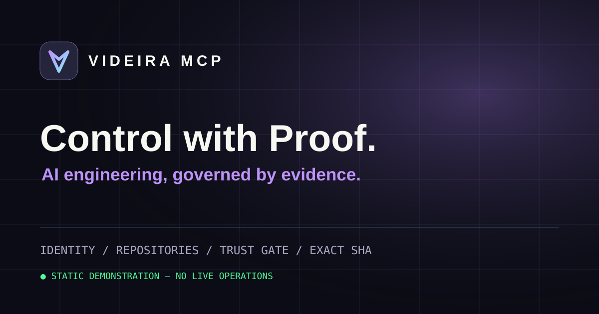
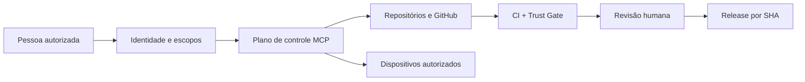

<p align="center">
  
</p>

<h1 align="center">Videira MCP · Control with Proof</h1>

<p align="center">
  <strong>Inteligência que executa. Controle que comprova.</strong><br />
  Um ecossistema de engenharia de IA guiado por identidade, autorização e evidências.
</p>

<p align="center">
  <a href="https://videirafo.github.io/videira-mcp-showcase/"><strong>Explorar a apresentação</strong></a> ·
  <a href="https://videirafo.github.io/videira-mcp-showcase/#demo">Demo interativa</a> ·
  <a href="#arquitetura">Arquitetura</a> ·
  <a href="#segurança">Segurança</a> ·
  <a href="#engineering-dna">4 padrões</a>
</p>

<p align="center"><strong>STATIC SHOWCASE</strong> · MCP · Node.js / TypeScript architecture · MIT (showcase only)</p>

---

## Uma plataforma, um fluxo governado

**Videira MCP** é um plano de controle técnico projetado para conectar ferramentas MCP, repositórios, GitHub, CI e operações autorizadas. A arquitetura do produto utiliza Node.js, TypeScript, MCP, OAuth e políticas de execução; seu ciclo de engenharia inclui verificação automatizada, revisão e evidências de release.

Esta é a **vitrine pública independente** do projeto, com uma experiência interativa de demonstração. O núcleo operacional, sua configuração privada, credenciais e histórico interno **não fazem parte deste repositório**.

### O que você encontra aqui

| Área | Experiência | Limite da vitrine |
| :--- | :--- | :--- |
| **Engineering workflow** | Discover → Validate → Review → Release | Apenas simulação no navegador |
| **Identidade e autorização** | Visão de OAuth, escopos e controle explícito | Nenhum login real nesta página |
| **GitHub / CI** | Etapas de verificação, revisão e commit exato | Nenhum acesso a repositórios reais |
| **Dispositivos autorizados** | Conceito de acesso e diagnóstico governado | Sem controle remoto na demo |
| **AI Agent Engineering Core** | 4 referências de metodologia verificáveis | Sem execução de plugins ou provedores |

## Arquitetura



A apresentação usa estados ilustrativos. A aplicação real mantém suas políticas de acesso, autorização de ferramentas e release governada; **nenhuma ação da demo alcança a infraestrutura**.

## Engineering DNA

Quatro fontes públicas inspiram a metodologia de trabalho; suas ideias são adaptadas, **sem copiar ou executar plugins de terceiros**:

| Referência | Padrão aplicado |
| --- | --- |
| [obra/superpowers](https://github.com/obra/superpowers) | Especificação, TDD, revisão e evidências |
| [multica-ai/andrej-karpathy-skills](https://github.com/multica-ai/andrej-karpathy-skills) | Simplicidade, mudanças cirúrgicas, hipóteses explícitas |
| [ayghri/i-have-adhd](https://github.com/ayghri/i-have-adhd) | Ações concretas, passos curtos e acompanhamento |
| [nyldn/claude-octopus](https://github.com/nyldn/claude-octopus) | Perspectivas independentes, discordâncias e revisão humana |

Os SHAs de referência adotados no piloto do núcleo estão documentados no repositório de engenharia privado. Esta vitrine apenas descreve a metodologia.

## Segurança

O projeto enfatiza controles técnicos verificáveis; **nenhum software deve ser apresentado como impossível de comprometer**.

- **Demo estática:** HTML, CSS, SVG e JavaScript local. Sem backend, formulários, contas, cookies analíticos ou acesso a tokens.
- **Sem credenciais:** não publica tokens, senhas, segredos, configurações da VPS, automações privadas ou histórico interno.
- **Dados fictícios explícitos:** cada estado da demo é rotulado como `SIMULATED`, `MOCK_PASS` ou `BLOCKED_BY_DEFAULT`.
- **Governança:** CI, revisão humana, menor privilégio e validação de origem são responsabilidades separadas do sistema operacional.

Leia [SECURITY.md](./SECURITY.md). Para reportar falhas, **não abra uma issue contendo chaves, credenciais ou dados pessoais**.

## Experimente a demonstração

**[Abrir o site oficial da vitrine →](https://videirafo.github.io/videira-mcp-showcase/)**

A demo mostra quatro momentos do processo:

1. **Discover:** ferramentas permitidas e inspeção conceitual.
2. **Validate:** exemplos fictícios de resultados de validação.
3. **Review:** pareceres simulados divergentes e exigência de decisão humana.
4. **Release:** bloqueio padrão quando o SHA, aprovação e status confiável não estão presentes.

O botão de idioma alterna português/inglês. O botão de cópia exporta apenas os dados simulados em JSON.

## Desenvolvimento desta vitrine

```bash
git clone https://github.com/Videirafo/videira-mcp-showcase.git
cd videira-mcp-showcase
node --test tests/*.test.mjs
# Abrir docs/index.html em um navegador
```

Não requer Node para visualizar o HTML; Node é usado apenas nos testes de integridade. GitHub Pages publica a pasta `/docs` da branch `main`.

## Status e transparência

| Item | Estado |
| --- | --- |
| Vitrine e demo | Pública, estática e independente |
| Conteúdo GitHub Pages | Somente arquivos desta vitrine |
| Conexão da demo à VPS | **Nenhuma** |
| Código do controle remoto | **Não publicado aqui** |
| Acesso operacional dos visitantes | **Nenhum** |
| Produto Videira MCP completo | Evolução governada em repositório interno |

Se você deseja acompanhar o ecossistema, visite [Videirafo no GitHub](https://github.com/Videirafo).

---

<p align="center"><sub>VIDEIRA MCP · Built with intent. Verified with evidence. · Showcase © 2026</sub></p>
